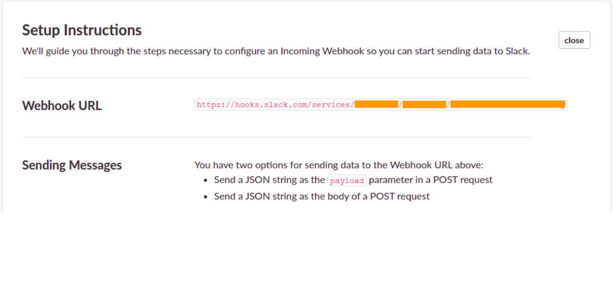
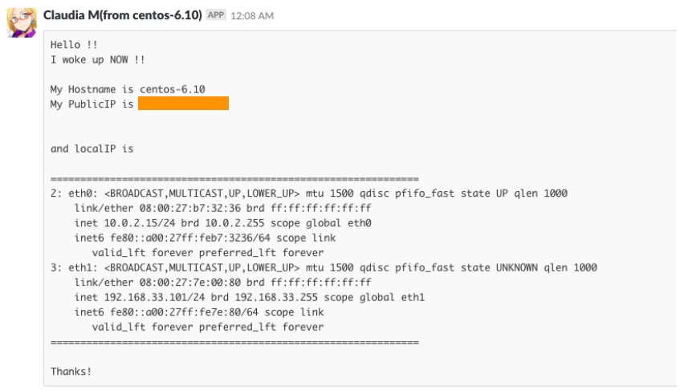

# Notify Server

## 概要

+ systemd(およびinit.d)を利用して、サーバが(再)起動した際に Slack に IP アドレスを通知させる

## 種類

+ `systemd` を使うOS
    + CentOS 7.5
    + Ubuntu 16.04
    + Ubuntu 18.04
    + Debian 8.11
    + Debian 9.5
+ `init.d` を使う OS
    + CentOS 6.10

## 設置方法

### 1. slackのWebhookを作成する


+ Incoming WebHooks
    + https://slack.com/apps/A0F7XDUAZ
    + 上記から、受け取るslack上のチャンネルとWebHookを設定する


+ e.g. slackのチャンネル名 `ntf-me` で作ってみると以下のよう




### 2. サーバにてスクリプトを配置する

+ `sudo` が使えるユーザになる
+ 以下のスクリプトをSUDO権限を持っているユーザにて行う
    + `notify-server` というユーザを作成する例

    ```
    $ sudo su -
    #
    # export _USER_NAME='notify-server'
    # useradd -m -s /bin/bash ${_USER_NAME}
    # echo "${_USER_NAME}    ALL=(ALL:ALL) NOPASSWD: ALL" > /etc/sudoers.d/${_USER_NAME}
    # chmod 0440 /etc/sudoers.d/${_USER_NAME}
    ```

+ スクリプトを置くPATHに移動( `/usr/local/bin` の配下に置きます)

```
cd /usr/local/bin
```
+ repositoryをcloneする

```
sudo git clone https://github.com/iganari/notify-server.git && cd notify-server
```

+ 通知するslackのチャンネル名とWebhookのURLを入れて、スクリプトを完成させる

```
export slack_webhook='https://hooks.slack.com/services/hogehoge/testtest/fizzbuzz'
export slack_channel='ntf-me'

cd bin
sudo cp notify-me.sh.sample notify-me.sh
```
```
sudo sed -i -e "s|SLACK_WEBHOOK|${slack_webhook}|g" notify-me.sh
sudo sed -i -e "s|SLACK_CHANNEL|${slack_channel}|g" notify-me.sh
```
```
sudo chmod 0755 notify-me.sh
sudo chmod 0755 send-notify.sh
```
```
cd ..
```

+  初期配置スクリプト実行  

```
sudo sh init.sh
```

## サービス確認方法

### systemd

+ 状態の確認

```
sudo systemctl status send-notify
```

+ 定義ファイルが読み込み可能か確認する

```
sudo systemctl list-unit-files --type=service | grep send-notify
```

+ 自動起動の確認

```
sudo systemctl list-unit-files --state=enabled | grep send-notify
```

+ 設定変更時の再読込
    + 仮に変更・修正した場合

    ```
    sudo systemctl daemon-reload
    ```

### init.d

+ 状態の確認

```
sudo service send-notify status
```

+ 自動起動の確認

```
sudo chkconfig --list | grep send-notify
```

+ 参考URL
    + http://kazmax.zpp.jp/linux_beginner/self-made_service_chkconfig.html
    + http://makisuke.seesaa.net/article/6066867.html

## 通知例

+ こんな感じでクラウディアさんが教えてくれます


