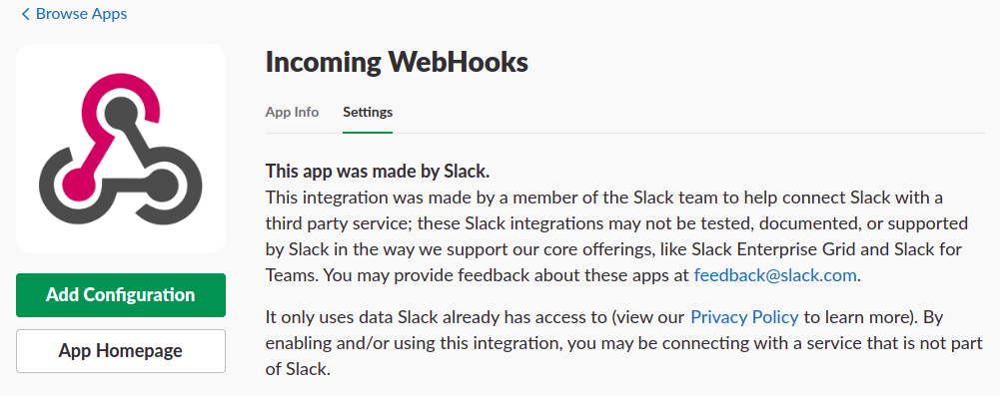
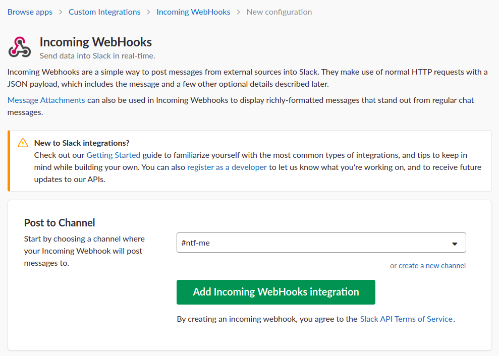

# notify-server

## 種類

+ `systemd` を使うOS
    + CentOS 7.5
    + Ubuntu 16.04
    + Ubuntu 18.04
    + Debian 8.11
    + Debian 9.5
+ `init.d` を使うOS
    + CentOS 6.10

## 設置方法

### 1. slackのWebhookを作成する


+ Incoming WebHooks
    + https://slack.com/apps/A0F7XDUAZ
    + 上記から、受け取るslack上のチャンネルとWebHookを設定する





+ e.g. slackのチャンネル名 `ntf-me` で作ってみると以下のよう





### 2. サーバにてスクリプトを配置する

+ サーバログイン
+ `sudo` が使えるユーザになる
   + 今回は `iganari` にて行なう
   + `hejda-admin` になる

```
sudo su - hejda-admin
```

+ スクリプトを置くPATHに移動( `/usr/local/iganari` を想定)

```
cd /usr/local/hejda
```
+ repositoryをcloneする

```
git clone https://gitlab.com/hejda/tools/notify-server.git && cd notify-server
```

+ 通知するslackのチャンネル名とWebhookのURLを入れて、スクリプトを完成させる

```
export slack_webhook='hogehoge'
export slack_channel='fugafuga'

cd bin
cp notify-me.sh.sample notify-me.sh

sed -i -e "s/SLACK_WEBHOOK/$slack_webhook/g" notify-me.sh
sed -i -e "s/SLACK_CHANNEL/$slack_channel/g" notify-me.sh

```


+  初期配置スクリプト実行  

```
sh init.sh
```

## サービス確認方法

### systemd

+ 状態の確認

```
sudo systemctl status send-notify
```

+ 定義ファイルが読み込み可能か確認する

```
sudo systemctl list-unit-files --type=service | grep send-notify
```

+ 自動起動の確認

```
sudo systemctl list-unit-files --state=enabled | grep send-notify
```

+ 設定変更時の再読込
    + 仮に変更・修正した場合

    ```
    sudo systemctl daemon-reload
    ```

### init.d

+ 状態の確認

```
sudo 
```

+ 自動起動の確認

```

```

+ 参考URL
    + http://kazmax.zpp.jp/linux_beginner/self-made_service_chkconfig.html
    + http://makisuke.seesaa.net/article/6066867.html

## 以下メモ


### initd時代のPATH

```
/etc/rc.d/rc.d
```

に書いていた。
もしくは

```
/etc/rc.d/rc/local
```

に記載していた


### systemd時代のPATH


+ 所定のPATHに移動

```
cd /usr/local/hejda
cd notify-server
```

+ スクリプトの確認

```
ll bin/endless-hello.sh
ll etc/systemd/system/endless-hello.service
```

+ 自動起動設定

```
$ sudo systemctl enable /usr/local/hejda/notify-server/etc/systemd/system/endless-hello.service
```

+ 起動確認

```
sudo tailf /tmp/hello.log
```


+ 起動

```
$ sudo systemctl start endless-hello
```

+ ステータス確認

```
$ sudo systemctl status endless-hello
```

+ 定義ファイルが読み込み可能か確認する
    + 下記のコマンドで表示されればOK

```
$ sudo systemctl list-unit-files --type=service  | grep endless-hello
$ sudo systemctl list-unit-files --state=enabled | grep endless-hello
```

# 起動確認メモ

+ CentOS 7.5
    + OK
+ Debian 8.11
    + `network.service` が無くて起動出来ない
    + systemd自体はある
+ Ubuntu 16.04
   + vagrantのbugのせいか、そもそも起動せず
+ Ubuntu 18.04
   + `Failed to start send-notify.service: Unit network.service not found.`
